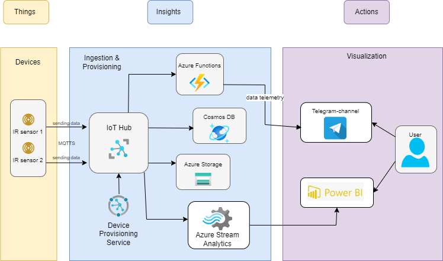
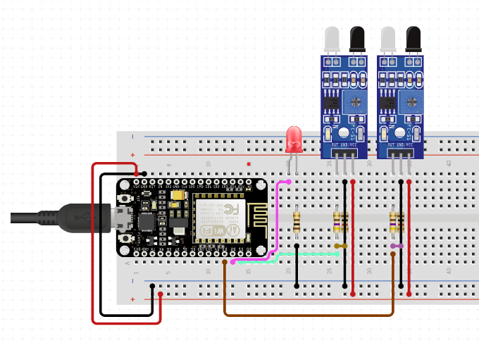
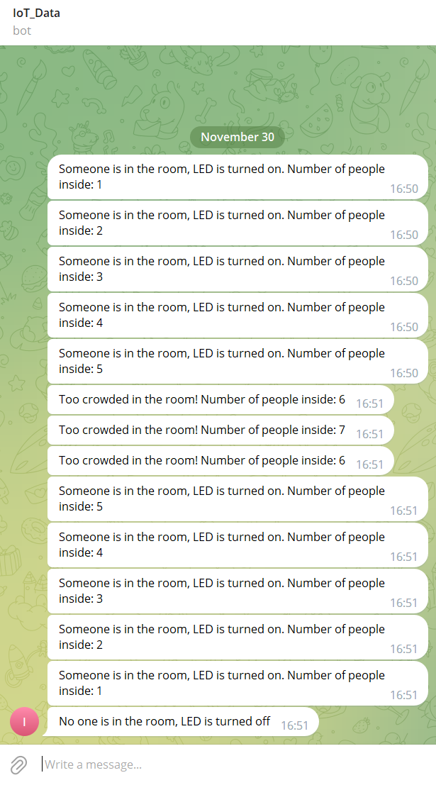
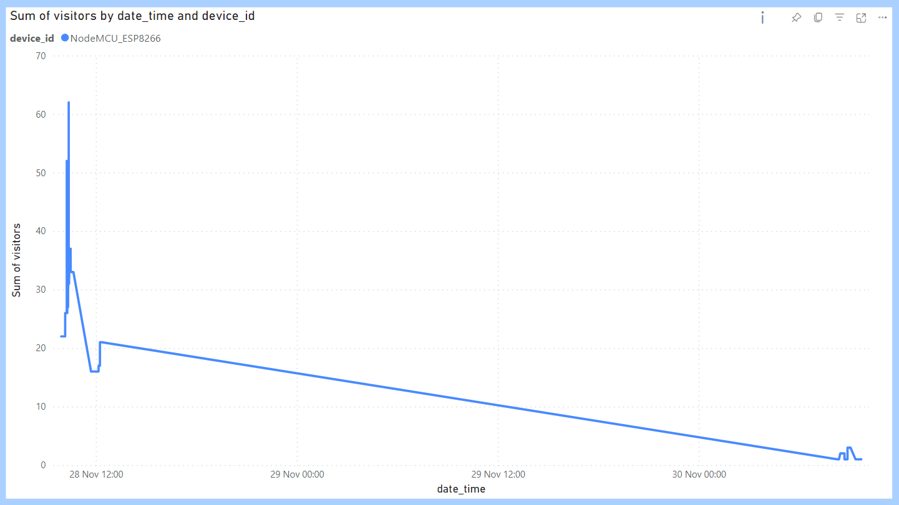

# Azure-Powered Visitor Counter and Room Light Control

## Table of Contents
- [Azure-Powered Visitor Counter and Room Light Control](#azure-powered-visitor-counter-and-room-light-control)
  - [Table of Contents](#table-of-contents)
  - [Overview](#overview)
  - [Installation](#installation)
  - [System Architecture](#system-architecture)
  - [Hardware Components](#hardware-components)
  - [Software Components](#software-components)
  - [Workflow](#workflow)
  - [Security and Scalability](#security-and-scalability)

## Overview
The project implements an intelligent system for visitor counting and light control. Two infrared motion sensors track movement at the entrance, with an microcontroller ESP8266 capturing and transmitting data to Azure IoT Hub via MQTT. The collected information is stored in Azure Cosmos DB and Azure Storage in JSON format. Azure Functions process the data, sending real-time notifications via Telegram and controlling an LED based on room occupancy. The project aims for efficient room management, user awareness through notifications, and utilizes Power BI for monitoring key metrics.

## Installation
1. Install the latest version of the Arduino IDE on your computer.
2. Install the ESP8266 board package in the Arduino IDE.
3. Install the Azure SDK for C library in the Arduino IDE library manager.

## System Architecture

## Hardware Components
- 2 IR motion sensors (for counting incoming and outgoing visitors)
- LED lamp (room lighting)
- Node-MCU ESP8266 board for sensor data processing

## Software Components
- Arduino sketch for reading sensor data and sending it to Azure IoT Hub
- Azure IoT Hub for data transmission
- Azure Cosmos DB and Azure Storage for storing sensors data
- Azure Functions for processing data from Cosmos DB and IoT Hub
- Power BI Data dashboard

## Workflow
1. **Sensor Data Collection:** 
   - The Arduino sketch captures data from two IR motion sensors (IR_SENSOR_PIN and IR_SENSOR_PIN2), counting visitors by tracking changes in sensor states (variables irSensorValue and irSensorValue2).

   - The loop function compares current sensor values with their previous states (prevIrSensorValue and prevIrSensorValue2). If changes are detected, indicating someone entering or exiting, counters are updated.

   - Telemetry, in the form of JSON payload, is transmitted to Azure IoT Hub only when sensor values change. This data, containing visitor counts, is published to the specified MQTT topic for further processing.

   - The sketch continuously checks the MQTT loop to ensure effective communication with Azure IoT Hub. This guarantees timely updates on visitor counts, keeping the system responsive to changes in the room's occupancy.
2. **Data Storage:** 
   - **Azure Cosmos DB:** 
    Azure IoT Hub directs data to Azure Cosmos DB, ensuring a reliable and scalable storage solution for event streaming.

    - **Azure Storage:** 
    Azure Storage serves as the designated platform for file storage needs. All data generated by Azure IoT Hub is efficiently stored within a specified container in JSON format. This leverages Azure Storage's capabilities for highly available, scalable, and secure cloud storage of diverse data objects.
3. **Azure Functions:**
   - **Telegram Notification:** 
    The Python script, deployed as an Azure Function, processes events from Azure Event Grid. It extracts visitor count information and triggers Telegram notifications based on room occupancy. 
    
        - If the room is crowded, it sends an alert;
        - If someone is inside, it turns on the LED and send notification;
        - If the room is empty, it turns off the LED.
    
        The script uses the Telegram Bot API to send messages, handling errors and logging responses for monitoring. In essence, it serves as a real-time notifier for room status changes.

4. **Light Control:** LED lamp is controlled based on sensor data, turning on/off with detected occupancy.
   
5. **Data Visualization:** I use Power BI as my data dashboard, where I can see and analyze information gathered from Azure IoT Hub. This setup makes it simple to ask questions about the data and create reports, offering insights into how well the intelligent room system is doing. With Power BI, I can easily spot trends, patterns, and get live updates on room occupancy and other key metrics."

## Security and Scalability
For enhanced security and scalability in this project, it would be advantageous to incorporate a number of measures.

**Azure Device Provisioning Service** streamlines the onboarding process for IoT devices, automating registration and providing centralized key and certificate management. This not only strengthens security but also simplifies the deployment of new devices, contributing to the project's scalability.

Implementing **Azure Key Vault**, certificates, and Hardware Security Modules (HSM) is crucial to safeguard sensitive information such as keys and passwords. This ensures that confidential data is not exposed in firmware or uploaded to repositories.

Moreover, leveraging Azure's scalable and flexible payment plans allows for cost-effective scaling based on usage patterns. Additionally, **the inherent IoT security features provided directly from the Azure hub** contribute to a robust security posture for the entire system.

Implementing the **MQTTS** (MQTT Secure) protocol. MQTTS improves data transmission security by adding encryption. In the project, this is applicable when IoT nodes, such as Node-MCU ESP8266, exchange data with Azure IoT Hub using the MQTT protocol. Data encryption ensures secure information transfer, minimizing the risks of interception or unauthorized access.

Make sure that your **Telegram bot token is stored in a secure location, such as Azure Key Vault**. Securing the Telegram Bot token prevents its leakage and unintended use. This is a critical security aspect that should be considered during the project implementation.

By adopting these measures, the project not only mitigates vulnerabilities and unauthorized access but also establishes a foundation for secure and scalable IoT operations.

